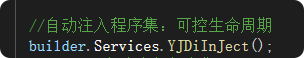
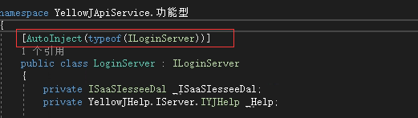

# YellowJHelp

#### 介绍

[Gitee]: v2.2.0	"https://gitee.com/xiaoyi1314/yellow-jhelp"

通用解决方案
缓存，MD5加密，字段截取，集合类型差集计算，Cookie，Session
Kafka使用
webapi调用
Redis使用`

#### 软件架构
netstandard2.1
Framework 4.6.1+

| 集成第三方      |
| --------------- |
| Confluent.Kafka |
| Mapster         |
| Autofac         |
| NewLife.Redis   |
| SqlSugarCore    |

#### 版本说明
2.0.0：优化结构，新增Server层和Iserver层，实现接口层封装，满足IOC开发

#### 程序集自动注入说明：满足IOC开发

案列：Net6

在Program类中注入

`builder.Host.YJAutofacDiInJect();`

或者

`builder.Services.YJDiInJect();`

类库中满足如：

`[AutoInject(typeof(ILoginServer))]`

声明的都将自动注入程序集

#### 方法库函数介绍
##### YJHelp
|  YJHelp |  IYJHelp  |
|---|---|
| message      |  消息注明 |
| MD5Encrypt   |  32位MD5加密 |
| YellowJLog   |  文件流日志 |
| MidStrEx     |  字段截取 |
| IsString     |  string中是否包含某个值 |
| Cache        | 缓存方法库  |

##### YJHelpKafka
|  YJHelpKafka |  IYJHelpKafka  |
|---|---|
| Produce                  | 发布者  |
| Produce                  | 发布者-随机分区  |
| ProduceAdmin             | 发布者（带账号密码）  |
| ProduceAdminPartition    | 发布者-随机分区（带账号密码）  |

##### YJHelpRedis
|  YJHelpRedis | IYJHelpRedis   |
|---|---|
| RedisCli           | redis 配置中心  |
| Get                | 获取单个实体|
| GetList            | 获取列表List  |
| Add                | 添加，已存在时不更新  |
| ListSetW           | 写入集合：尾部增加  |
| ListSetT           | 写入集合：头部增加  |
| Clear              | 清空所有缓存项  |
| Remove             | 清空所有缓存项：按Key值  |
| GetExpire          | 获取缓存项有效期  |
| ContainsKey        | 是否存在|
| Count              | 缓存个数  |
| SCARD              | 返回集合个数  |

##### YJHelpT
| YJHelpT  | IYJHelpT    |
|---|---|
| SpliteSourceBySize    | 将集合按大小分组  |
| SpliteSourceByCount   |将集合安按组数分组|
| DistinctList          | 集合去重(哈西,只针对数值类型)  |
| Merge                 | 合并两个集合的函数-不允许有重复项  |
| MergeC                | 合并两个集合的函数-允许出现重复项  |
| DiffsetT              | 获取差集（集合）  |

#### 安装教程

#### 使用说明
方法库

YJHelp
YJHelpKafka
YJHelpRedis
YJHelpWebApi

#### 参与贡献

